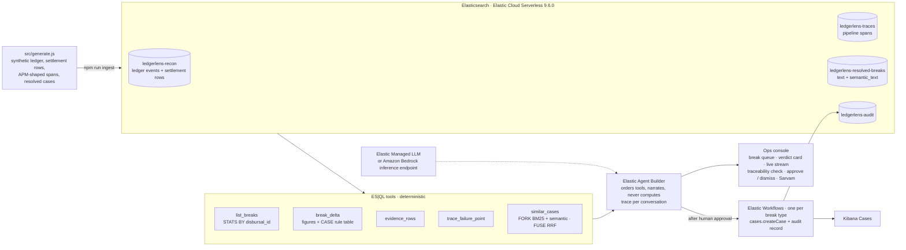

# LedgerLens

**An explainable reconciliation-break investigation agent for lending and payments operations, built on Elastic Agent Builder.**

> **The model explains. ES|QL decides. Every number is traceable.**

Forge the Future 2026 · Elastic × AWS · Track 4: Industry Vertical Demo (BFSI)

## At a glance

| | |
|---|---|
| **What it does** | Investigates a reconciliation break end to end, writes an audit-ready report that a finance or compliance reviewer can sign off in seconds, and then takes the one action that fits the break, after a human approves. |
| **Who it is for** | Operations, finance and compliance teams at lenders, payment service providers (PSPs) and banks. |
| **The design rule** | The language model never computes a figure. Every amount, count, delta, date, identifier and classification is produced by a deterministic ES\|QL query and passed through verbatim. The console re-checks every figure in every report against the tool results and shows the score. |
| **Grounded, not guessed** | The model contributes reasoning and language, not facts. Every fact comes from four Elasticsearch indices through ten Agent Builder tools. |
| **Not just conversational** | Five Elastic Workflows, one per break type. The agent recommends and drafts; a human approves; the workflow opens a Kibana case and/or writes an append-only audit record. |
| **Measured** | 14 of 14 seeded breaks detected across 3 business days, 0 false positives. One ES\|QL query matches a 388-disbursal day in 30 ms. Same-type precedent at rank 1 for all 5 break types from one hybrid query. 19 of 19 unit tests pass. |
| **Stack** | Elastic Cloud Serverless (Elasticsearch 9.6.0) · ES\|QL · `semantic_text` · Agent Builder · Elastic Workflows · Kibana Cases · Amazon Bedrock through an Elasticsearch inference endpoint · Sarvam Translate, text-to-speech and speech-to-text · Node.js 20+, zero npm dependencies |
| **Data** | 100% synthetic, generated by `src/generate.js` from a fixed seed. No production, customer or partner data. See [DATA.md](DATA.md). |
| **Demo video** | [Google Drive folder](https://drive.google.com/drive/folders/1NshA5kMjrgcHVpebO42XmyKdH1lsAHc7?usp=sharing) |

## Team

- Team name: **[FILL IN: the team name as registered with HackCulture]**
- Project name: LedgerLens
- Members: Mridul Mahajan (Backend Engineer, Lending) · **[FILL IN: remaining members and GitHub usernames]**

## Problem

In any lending or payments business, money moves across three systems that must agree about every disbursal:

1. the internal **event-sourced ledger** (a ledger stored as a sequence of events, so the full history of a payment can be reconstructed);
2. the **settlement file** from the partner PSP or bank (one row per credit, with the bank's UTR, the amount, the fee charged and the value date);
3. the **disbursal pipeline** that actually pushed the funds (its traces show the transfer call, the callback and any retries).

When they disagree, that is a **reconciliation break**: a disbursal booked as success with no credit in the bank file, the same disbursal debited twice, a fee that does not match the contracted rate card, a credit that lands a day late, or a shortfall that nothing explains.

Today an operations analyst investigates each break by hand: pull the ledger events, cross-check the statement, trace the payment logs, find a precedent, write a root cause, then decide what to do. From the builder's own experience operating this class of system in production, that takes 30 to 60 minutes per break (an estimate, not a benchmark). It does not scale on high-volume days, the write-up is only as trustworthy as one tired human at 11 pm, and meanwhile settlement cash sits in the nodal account, customer refunds wait, and every unexplained figure is audit exposure with the regulator.

Why existing tooling stops short:

- **Rules engines** match or they do not. When they do not, a human starts hunting.
- **Chat and RAG** can explain, but nobody can sign off on a number a language model produced. In regulated money movement an amount that came out of a model is an opinion. An amount that came out of `STATS SUM(amount_paise) BY disbursal_id` is a fact with a query attached.
- **Agents that only explain** stop where the work starts. The break still needs a case, a reversal request, a dispute entry or an escalation, and an audit trail that shows who approved it.

## Solution

LedgerLens is a multi-step agent on Elastic Agent Builder with a strict division of labour: **ES|QL computes, the model narrates, a workflow acts, a human approves.**

### From question to answer

1. **Match the day.** The reviewer opens the ops console and picks a business date. One ES|QL query, `ledgerlens.list_breaks`, matches every `DISBURSAL_SUCCEEDED` ledger event against every settlement row with a single `STATS ... BY disbursal_id` over a unified index. No join, no application code. For the demo day it flags 10 breaks out of 388 successful disbursals in 30 ms.
2. **See the verdict before the model speaks.** Clicking a break runs `ledgerlens.break_delta` at once. The console paints a verdict card (break type, the rule that fired, ledger vs settled vs delta, fee comparison) in tens of milliseconds, while the model is still starting. The card is display only: the report below still has to earn every figure itself.
3. **Investigate.** The agent follows `elastic/agent/instructions.md`. It calls `break_delta` first (the only tool that classifies), then `evidence_rows` and `trace_failure_point` together in one turn (neither depends on the other), then `similar_cases` with a plain-language description of what it found. Tool calls and narration stream live to the page over Server-Sent Events.
4. **Report.** The agent writes a fixed-format, audit-ready report: rule fired, figures, evidence rows each cited by event or row ID, the failing span in the pipeline trace with its error, root cause in plain language, a resolved precedent, the recommended action, the draft message that action will carry, and a confidence with what was ruled out. The console then checks every amount and identifier in the report against the tool results and highlights each one: green if it appears verbatim in a tool result, red if it does not. The score, for example `18 / 18 traced`, is shown above the report.
5. **Act, behind a human.** The report ends with `Reply approve to <action>, or dismiss`. On approve, the agent calls the one workflow tool that matches the break type. The Elastic Workflow opens a Kibana case where one is warranted and writes an append-only record to `ledgerlens-audit`. The console shows the audit line with the case ID. The agent cannot run any workflow without an explicit approval word in the conversation. Writing a report is not approval.
6. **Prove and translate.** The Kibana link opens the Agent Builder trace of the conversation: every tool call with its ES|QL and its rows, and prose from the model. Optionally, one click renders the report in Hindi or Kannada through Sarvam Translate, and the traceability check re-runs on the translation.

### The five break types and their actions

| `break_type` | Rule (computed in ES\|QL) | Seeded mechanism | Action on approve (Elastic Workflow) | Writes |
|---|---|---|---|---|
| `MISSING_CREDIT` | R1: ledger `DISBURSAL_SUCCEEDED` present and settlement rows = 0 | Success booked on the partner's synchronous `ACCEPTED`; the terminal callback timed out; the status poll returned `FAILED` (beneficiary account invalid, or insufficient nodal balance). Funds never moved | `ledgerlens.open_case`: open a high-severity case so finance can reverse the ledger entry | Kibana case + audit `CASE_OPENED` |
| `DOUBLE_DEBIT` | R2: settlement rows > 1 | Gateway timeout (HTTP 504) on attempt 1; retry without an idempotency key; the partner executed both, two UTRs | `ledgerlens.raise_reversal`: raise a reversal request with the partner for the duplicate UTR | Kibana case + audit `REVERSAL_REQUESTED` |
| `FEE_MISMATCH` | R3: principal delta = 0 and fee delta ≠ 0 | IMPS slab charged on a NEFT transfer, or GST applied twice. Pipeline clean | `ledgerlens.log_fee_dispute`: log the overcharge in the fee dispute register (commercial, not operational: no case) | audit `FEE_DISPUTE_LOGGED` |
| `TIMING_T1` | R4: principal and fee match, value date > business date | Initiated after the partner's 23:00 IST cut-off; the credit is in the next day's file | `ledgerlens.close_timing`: close as self-clearing, citing the next-day row and value date | audit `CLOSED_SELF_CLEARING` |
| `UNRESOLVED` | R5: one row, non-zero principal delta, no rule matches | Credit ₹1,000 short, fee correct, pipeline clean. Nothing in the data explains it | `ledgerlens.escalate_partner`: open a medium-severity case and record the escalation to the partner, quoting the UTR | Kibana case + audit `ESCALATED_TO_PARTNER` |

A clean disbursal classifies as `MATCHED` (rule R0) and a disbursal the partner rejected at initiation as `NO_LEDGER_SUCCESS`. Neither is a break and neither has an action. A small share of seeded disbursals (30 of 1,200, about 2%) are rejected this way and must never be flagged; the verify script checks that.

### Honest uncertainty is a first-class outcome

When no rule explains a break, the agent does not guess. For `UNRESOLVED` it writes what the data shows, states plainly that no rule and no indexed evidence explains it, lists what it ruled out (missing credit, double debit, fee mismatch, timing, pipeline failure) with the figure that rules each one out, marks confidence Low, and recommends escalation. A break the agent cannot resolve, and says so, is worth more to a compliance reviewer than a confident wrong root cause.

## Architecture

### The path from a question to a grounded answer

```
src/generate.js  --npm run ingest-->  Elasticsearch (Elastic Cloud Serverless, 9.6.0)
                                       |- ledgerlens-recon            ledger events + settlement rows, one schema
                                       |- ledgerlens-traces           disbursal-pipeline spans, APM/ECS shape
                                       |- ledgerlens-resolved-breaks  past resolved cases, text + semantic_text
                                       '- ledgerlens-audit            append-only record of every action taken
                                                    |
                    five ES|QL tools  (deterministic, parameterised; the only place money is computed)
                                                    |
                    Elastic Agent Builder agent "ledgerlens"  (orders the tools, narrates, never computes)
                          |                                            |
     ops console (Node, zero dependencies)            after human approval: one of five Elastic Workflows
     queue . verdict card . live stream .             cases.createCase + elasticsearch.request
     traceability check . approve / dismiss .          --> Kibana Cases and ledgerlens-audit
     Sarvam Hindi / Kannada . trace link
                          |
     LLM: the project's Elastic Managed LLM, or Amazon Bedrock through the "ledgerlens-bedrock" inference endpoint
```



### Data: how it arrives and how it is mapped

Everything is generated by `src/generate.js` from seed `20260916` and bulk-loaded by `src/ingest.js` (`_bulk`, batches of 500, retry while the `semantic_text` inference warms up, `_refresh` after load). Three business days, 400 disbursals a day, three fictional partners (PAYSTREAM, NORTHBANK, MERIDIAN), three rails (IMPS, NEFT, RTGS), a GST-inclusive rate card (IMPS ₹5.90, NEFT ₹2.95, RTGS ₹23.60). All money is integer paise.

| Index | Docs | Holds | Mapping decisions (`elastic/mappings/*.json`, each with a `_meta` note) |
|---|---|---|---|
| `ledgerlens-recon` | 3,569 | 2,400 ledger events (`DISBURSAL_INITIATED`, `DISBURSAL_SUCCEEDED`, `DISBURSAL_FAILED`) and 1,169 normalised settlement rows in one schema, told apart by `source` | `dynamic: strict`. Every identifier, code and business date is `keyword`. Money is `long` integer paise, never float. Only `description` and `narration` are `text`. One schema for both sides is what lets a single `STATS ... BY disbursal_id` do the match with no join. |
| `ledgerlens-traces` | 5,980 | Disbursal-pipeline spans (`psp.transfer`, `psp.callback`, `psp.status-poll` and the surrounding steps) with `trace.id`, `span.name`, `event.outcome`, `error.type`, `http.response.status_code`, `labels.*` | Shaped like Elastic APM / ECS so the same ES\|QL runs unchanged against `traces-apm-*` in production. `labels.disbursal_id` is the correlation key to the ledger and settlement rows. |
| `ledgerlens-resolved-breaks` | 84 | Past breaks a human resolved, with deliberately varied wording, root cause, resolution, who resolved it and how long it took | `summary` is `text` and is `copy_to` `summary_semantic`, a `semantic_text` field embedded at index and query time by the project's default inference endpoint (`.jina-embeddings-v5-text-small`, 1,024-dimension float vectors, cosine similarity). There is no embedding code in the repository. |
| `ledgerlens-audit` | grows with use | One document per action a workflow took after approval: action, disbursal, break type, case ID, partner, UTR, figures, message, approver, execution ID | `dynamic: strict`. Figures are stored as `keyword` because they are passed through verbatim from ES\|QL, never re-parsed. |

Why synthetic: reconciliation data is regulated and belongs to the institution that produced it, and there is nothing legitimate to scrape. Synthetic data keeps every seeded break reproducible with a known answer, and the generator itself is the complete, publishable source. [DATA.md](DATA.md) is the provenance statement.

### Retrieval: the ES|QL tools

Each tool is one `.esql` file in `elastic/tools/`, with the same `?name` parameters that Agent Builder uses, so `src/verify.js` runs the exact tool text against the answer key. Same query, same numbers, whether the agent or the verifier calls it.

| Tool (Agent Builder id) | Type | What it returns | ES\|QL constructs |
|---|---|---|---|
| `ledgerlens.list_breaks` | `esql` | Every break for one `business_date`: type, ledger vs settled, delta, rows, fee comparison | `STATS SUM / COUNT / MAX ... BY disbursal_id` over the unified index, a `CASE` rule table, `WHERE break_type != "MATCHED"` |
| `ledgerlens.break_delta` | `esql` | The exact figures, `break_type`, `rule_fired` and every source ID for one disbursal. The only place a break is classified | `STATS` with `VALUES()` to collect event IDs, row IDs and UTRs; `CASE` for rules R0 to R5; paise to INR with `/ 100.0` |
| `ledgerlens.evidence_rows` | `esql` | Every ledger event and settlement row for one disbursal, in time order, each with its own ID | `KEEP`, `SORT @timestamp ASC` |
| `ledgerlens.trace_failure_point` | `esql` | The pipeline spans, failed spans first, with `error.type`, `error.message`, PSP status and reason, retry attempt, idempotency-key flag, settlement cycle | `EVAL is_failure = CASE(event.outcome == "failure", 1, 0)`, `SORT is_failure DESC, @timestamp ASC` |
| `ledgerlens.similar_cases` | `esql` | Up to five resolved precedents for a plain-language description of the break | Hybrid search in one query: `FORK` a lexical BM25 branch `MATCH(summary, ?query)` and a semantic branch `MATCH(summary_semantic, ?query)`, then `FUSE` (reciprocal rank fusion), `SORT _score DESC` |
| `ledgerlens.open_case` · `ledgerlens.raise_reversal` · `ledgerlens.log_fee_dispute` · `ledgerlens.close_timing` · `ledgerlens.escalate_partner` | `workflow` | Run the matching Elastic Workflow and return its console line (case ID, audit record ID, execution ID) for the agent to quote verbatim | `cases.createCase`, `elasticsearch.request` |

The hybrid search is the search nuance worth explaining: identifiers such as UTRs, partner names and error codes have no meaning to an embedding model, so the BM25 branch catches them exactly; an analyst's differently-worded description of the same failure has no shared tokens, so the semantic branch catches it. One ES|QL query, one search API, both halves fused.

### The agent

`src/setup-agent.js` creates or updates everything in Kibana through its API: the Bedrock inference endpoint when AWS credentials are present, the five workflows, the ten tools, the agent `ledgerlens` (instructions from `elastic/agent/instructions.md`), and then a smoke test that executes `ledgerlens.break_delta` through `/api/agent_builder/tools/_execute` with no LLM involved and checks the answer key.

The instructions carry two rules the whole project depends on, stated first and stated forcefully:

- **You never touch a number.** No computing, estimating, rounding or converting. Every amount, count, delta, date and identifier is copied verbatim from a tool result. `break_type` and `rule_fired` come from `ledgerlens.break_delta`, never from the model's judgement. The model may add the ₹ sign and Indian thousands separators, and nothing else.
- **You never act without approval.** The five workflow tools run only after the user has replied to a report with an explicit approval word. "Writing a report is not approval. Finishing an investigation is not approval. Silence is not approval."

One investigation is four model turns: `break_delta`; `evidence_rows` + `trace_failure_point` batched in one turn; `similar_cases`; the report. Independent tools are batched on purpose, because model round trips, not Elasticsearch, are where the time goes.

### The actions: Elastic Workflows

Five YAML workflows in `elastic/workflows/`, mapped to break types in `elastic/workflows/actions.json`, each registered as an Agent Builder `workflow` tool. Manual trigger, typed and described inputs, and three kinds of step: `cases.createCase` (owner `observability`, severity by break type, tags with the break type and disbursal ID, the full report in the description) with `on-failure: continue` so the record is still written if the Cases app is unavailable; `elasticsearch.request` to `POST` the audit document with `refresh=true`; and a `console` step whose output the agent quotes back. The workflows compute nothing: every field is an input passed through verbatim from a tool result or from the report's Draft message.

If the agent's own tool call ever misbehaves during a demo, `CASE_MODE=direct` makes the console run the same workflow through the Workflows API itself, with figures from `ledgerlens.break_delta` and the message lifted from the report's Draft message section. Nothing is computed there either.

### The ops console

`src/console/server.js` is a dependency-free Node server; `src/console/index.html` is one page. The browser never holds an Elastic API key. Routes: `/api/summary` (day totals and the break queue, two ES|QL queries in parallel), `/api/break` (the instant ES|QL verdict), `/api/investigate/stream` (Agent Builder `converse/async` piped as Server-Sent Events, with the blocking `converse` as fallback), `/api/chat` (approve, dismiss, follow-ups in the same conversation), `/api/audit`, `/api/act` (direct workflow fallback), `/api/chat/stream` (the chat drawer), and `/api/translate`, `/api/speak` and `/api/transcribe` (Sarvam).

On the page: four tiles (successful disbursals, disbursed value, breaks flagged by ES|QL with the query time, and "Figures computed by the LLM: 0, by construction"); the break queue with type, partner, ledger, settled, delta and rows; the investigation panel with the verdict card, the live step list, the streamed report, every amount and ID highlighted green or red with its source tool on hover, the `N / N traced` score, the approve button named after the action ("Approve → raise reversal with NORTHBANK"), dismiss, the audit line with the case link after an action, the Kibana trace link, Hindi and Kannada toggles, a business-date picker and a dark/light theme. The header shows which model is live. A Chat drawer holds a free-text conversation with the same agent, in the same Agent Builder conversation as the investigation on screen, so the operator can ask a follow-up such as what was ruled out, or list a day in their own words; every reply is checked by the same traceability code and shows its own `N / N traced` chip. With `SARVAM_API_KEY` set, a reply can be read aloud and a question can be spoken.

### Where the trust comes from

- **All money math lives in ES|QL.** `elastic/tools/*.esql` are the only places an amount, delta, count or classification is computed.
- **Every figure is checked, not just promised.** `src/console/traceability.js` collects every number and identifier from the tool results of a conversation and checks each amount and ID in the report against them, forgiving formatting (₹, Indian grouping, paise vs rupees, sign placement) but never digits. Unit tests prove it catches an altered figure and an invented case ID.
- **Actions are gated and audited.** The only writes the agent can perform are the five workflow tools, only after approval, and every one writes an append-only audit record naming the approver and the workflow execution.
- **Uncertainty is explicit.** `UNRESOLVED` has its own rule, its own report behaviour and its own action.
- **The trace is native.** Agent Builder records every tool call, its parameters and its rows for each conversation; the console links straight to it.

## Measured results

All figures below are the `npm run verify:report` run of 18 September 2026 against the team's Elastic Cloud Serverless project (Elasticsearch 9.6.0), scoring the exact ES|QL tool text against `data/answer-key.json`. The verbatim output is [BENCHMARKS.md](BENCHMARKS.md). Latencies are the ES|QL `took` value reported by Elasticsearch, not end-to-end wall clock.

| What | Result | Reproduce |
|---|---|---|
| Seeded breaks detected (`ledgerlens.list_breaks`) | **14 / 14** across 3 business days, **0 false positives** among 1,170 successful disbursals | `npm run verify`, section 1 |
| Per-break figures and classification (`ledgerlens.break_delta`) | **14 / 14** exact: break type, settlement rows, ledger, settled, delta, fee delta, UTRs | section 2 |
| Clean and partner-rejected disbursals | `MATCHED` and `NO_LEDGER_SUCCESS`, never flagged | section 3 |
| Failure point in the trace (`ledgerlens.trace_failure_point`) | **14 / 14**: the seeded failing spans surface first; clean pipelines report clean | section 4 |
| Evidence rows cite an ID | every row carries an `event_id` or `row_id` | section 5 |
| Precedent retrieval (`ledgerlens.similar_cases`, hybrid BM25 + semantic, RRF) | same-type precedent at **rank 1 for all 5** break types | section 6 |
| Demo day 2026-09-16 | 388 successful disbursals worth ₹24,71,32,300; 10 seeded breaks | section 7 |
| Figures and IDs in a report traced to a tool result | 18 / 18 on a captured live run; every live report shows its own `N / N` | [CHANGELOG.md](CHANGELOG.md), the console |
| Numbers computed by the LLM | **0**, by construction | `elastic/agent/instructions.md`, `src/console/traceability.js` |
| Unit tests | 19 / 19 | `npm test` |

| ES\|QL latency (median `took`) | ms | runs |
|---|---|---|
| `ledgerlens.list_breaks`, match one full day | 30 | 3 |
| `ledgerlens.break_delta` | 13 | 14 |
| `ledgerlens.trace_failure_point` | 11 | 14 |
| `ledgerlens.similar_cases`, hybrid | 128 | 5 |

**Where the time goes.** All the ES|QL in one investigation adds up to well under half a second. An end-to-end investigation observed with the Elastic Managed LLM took 28 to 45 s over 4 model calls, with the first token at about 15 to 17 s; the rest is model time, measured from the SSE stream ([OPTIMIZATION.md](OPTIMIZATION.md)). That is why the console shows the ES|QL verdict in tens of milliseconds and streams the model's work as it happens, and why the roadmap targets model turns, not Elasticsearch.

**Business baseline.** Manual investigation: 30 to 60 minutes per break, the builder's own estimate from operating this class of system in production, not a benchmark. Agent: the wall clock is shown in the console header on every run.

## Demo

- **Live URL or recording:** [Demo video, Google Drive folder](https://drive.google.com/drive/folders/1NshA5kMjrgcHVpebO42XmyKdH1lsAHc7?usp=sharing). The live system is the ops console (`npm run console`, http://localhost:3000) against the team's Elastic Cloud Serverless project, and the same agent inside Kibana at `/app/agent_builder`.
- **How to run locally:** see below. Node.js 20.6 or newer, an Elastic Cloud Serverless project and an API key. No npm install: there are no dependencies.
- **Sample queries or prompts:** see below.

### How to run locally

`.env` needs `ES_URL`, `ES_API_KEY` and `KIBANA_URL` (optionally `KIBANA_API_KEY`); optionally `AWS_ACCESS_KEY_ID`, `AWS_SECRET_ACCESS_KEY`, `AWS_REGION`, `BEDROCK_MODEL` for Bedrock and `SARVAM_API_KEY` for Hindi and Kannada.

```bash
npm run generate          # data/*.ndjson + data/answer-key.json, deterministic from seed 20260916
npm test                  # 19 tests: generator invariants, action registry vs workflow YAML, traceability checker
npm run ingest            # create the four indices with explicit mappings, bulk load
npm run verify            # run every ES|QL tool against the answer key, print the scorecard
npm run setup:agent       # Bedrock endpoint (if AWS credentials), 5 workflows, 10 tools, the agent, smoke test
npm run console           # http://localhost:3000
```

`npm run all` runs generate, ingest, verify and setup:agent in sequence. `AGENT_MODE=mock` fills the report template from the same ES|QL tools with no model, for developing the page; it shows a red MOCK banner and is never used for the demo.

### Sample prompts

In the console, click a row. In the Agent Builder chat in Kibana, type:

```
List the reconciliation breaks for 2026-09-16.
Investigate DSB-20260916-00114.
Investigate DSB-20260916-00150.
approve
```

The ten seeded breaks on the demo day, all verified by `npm run verify`:

| Disbursal | Type | Partner / rail | Ledger amount | What the agent finds |
|---|---|---|---|---|
| `DSB-20260916-00114` | `MISSING_CREDIT` | NORTHBANK / RTGS | ₹30,42,800.00 | Settled ₹0.00. `psp.callback` timed out, `psp.status-poll` returned FAILED: beneficiary account invalid. Open case. |
| `DSB-20260916-00039` | `MISSING_CREDIT` | MERIDIAN / NEFT | ₹6,47,700.00 | Same mechanism, reason: insufficient nodal balance. Open case. |
| `DSB-20260916-00385` | `MISSING_CREDIT` | NORTHBANK / NEFT | ₹6,26,900.00 | Same mechanism, reason: beneficiary account invalid. Open case. |
| `DSB-20260916-00277` | `DOUBLE_DEBIT` | NORTHBANK / NEFT | ₹4,76,800.00 | Settled ₹9,53,600.00 over two UTRs. `psp.transfer` hit a gateway timeout and was retried without an idempotency key. Raise reversal. |
| `DSB-20260916-00104` | `DOUBLE_DEBIT` | NORTHBANK / IMPS | ₹56,600.00 | Settled ₹1,13,200.00 over two UTRs, same mechanism. Raise reversal. |
| `DSB-20260916-00116` | `FEE_MISMATCH` | PAYSTREAM / NEFT | ₹7,19,800.00 | Principal matches; fee ₹5.90 charged vs ₹2.95 contracted (IMPS slab on a NEFT transfer). Log fee dispute. |
| `DSB-20260916-00315` | `FEE_MISMATCH` | NORTHBANK / IMPS | ₹3,63,200.00 | Principal matches; fee ₹6.80 vs ₹5.90 (GST applied twice). Log fee dispute. |
| `DSB-20260916-00266` | `TIMING_T1` | NORTHBANK / RTGS | ₹19,61,600.00 | Principal and fee match; value date 2026-09-17, initiated after cut-off. Close as self-clearing. |
| `DSB-20260916-00383` | `TIMING_T1` | NORTHBANK / IMPS | ₹4,01,100.00 | Same mechanism, value date 2026-09-17. Close as self-clearing. |
| `DSB-20260916-00150` | `UNRESOLVED` | PAYSTREAM / IMPS | ₹62,900.00 | Settled ₹61,900.00, one row, fee correct, all spans succeeded. No rule matches. The agent says so, lists what it ruled out, escalates. |

Four more seeded breaks on 2026-09-14 and 2026-09-15 (one each of the first four types) also appear, already resolved, in the precedent library with their real IDs, so retrieval can surface an exact match.

### Run of show

Five to seven minutes: the problem with one number, why current tooling stops short, then the product. Match the day; investigate a missing credit and watch the verdict land before the model speaks; read the report with every figure traced; open the trace in Kibana; investigate the unresolved break and watch the agent decline to guess; approve an action and show the audit record; the same report in Hindi; the architecture in one breath; the measured numbers. The full talk track, fallbacks and expected questions are in [DEMO.md](DEMO.md). The deck is `presentation/LedgerLens.pptx`.

## What we used

### Elastic

| Capability | How LedgerLens uses it | Where |
|---|---|---|
| Elastic Cloud Serverless | Elasticsearch 9.6.0 project. All data, tools, the agent, the workflows and the cases live there | `.env` |
| Explicit mappings | Four indices, `dynamic: strict`; `keyword` for every identifier and code, `long` paise for money, `text` only for narration; a `_meta` note explains each decision | `elastic/mappings/*.json`, `src/ingest.js` |
| Bulk ingest | `_bulk` in batches of 500, retry while `semantic_text` inference warms up, `_refresh` after load | `src/ingest.js` |
| ES\|QL | Five parameterised tools: unified-index match with `STATS ... BY`, a `CASE` rule table, `VALUES()` for source IDs; the same text runs in Agent Builder and in the verifier | `elastic/tools/*.esql`, `src/verify.js` |
| Hybrid search | `FORK` a BM25 branch and a semantic branch, `FUSE` with reciprocal rank fusion, `MATCH` on `text` and on `semantic_text`, in one ES\|QL query | `elastic/tools/ledgerlens.similar_cases.esql` |
| `semantic_text` and the Elastic Inference Service | `summary_semantic` embedded at index and query time by the project's default endpoint `.jina-embeddings-v5-text-small`; zero embedding code | `elastic/mappings/ledgerlens-resolved-breaks.json` |
| Agent Builder | Agent `ledgerlens` with 10 tools (5 `esql`, 5 `workflow`) and instructions carrying the no-numbers rule and the approval gate. APIs used: `/api/agent_builder/tools`, `/agents`, `/converse`, `/converse/async` (SSE), `/tools/_execute` (LLM-free smoke test). The per-conversation trace is the explainability artefact | `src/setup-agent.js`, `elastic/agent/instructions.md`, `src/console/server.js` |
| Elastic Workflows | Five YAML workflows, manual trigger, typed inputs, `cases.createCase` with `on-failure: continue`, `elasticsearch.request` to write the audit record, `console` output the agent quotes back; each exposed to the agent as a `workflow` tool; the Workflows API for the direct fallback | `elastic/workflows/*.yaml`, `elastic/workflows/actions.json` |
| Kibana Cases | High- or medium-severity cases carrying the full report, tagged with the break type and disbursal ID, for missing credits, double debits and unresolved breaks | the workflows |
| Inference API | `PUT /_inference/chat_completion/ledgerlens-bedrock` with the `amazonbedrock` service | `src/setup-agent.js` |

### AWS

- **Amazon Bedrock as the narration model, through an Elasticsearch inference endpoint.** `npm run setup:agent` creates `ledgerlens-bedrock` (service `amazonbedrock`, provider Anthropic, model `anthropic.claude-sonnet-4-5-20250929-v1:0`, region `us-west-2`) when `AWS_ACCESS_KEY_ID` and `AWS_SECRET_ACCESS_KEY` are set. The console detects the endpoint at start-up and routes the agent's conversations through it; the page header shows which model is live. Without it, the project's Elastic Managed LLM answers. Switching is one environment variable, `LLM_INFERENCE_ID`.
- **Status (18 Sep, 16:00 IST):** the endpoint exists in the project with the settings above. A test call at that time returned an AWS credential error (HTTP 403). **[UPDATE before 17:00: either "investigations run through Bedrock" once one has completed through it, or state that the Elastic Managed LLM is the live model path.]**
- **Hosting note.** The Elastic Cloud Serverless project used for the finale runs in the `asia-south1` (Mumbai) region on Google Cloud. AWS enters through Bedrock for model inference.
- **Named in the original proposal, not built:** S3 and Lambda ingest of partner files (files are bulk-loaded by `src/ingest.js`), and Bedrock Guardrails. See "What we would do next".

### Sarvam

- **Sarvam Translate** (`sarvam-translate:v1`, `POST https://api.sarvam.ai/translate`, source `en-IN`, targets `hi-IN` Hindi and `kn-IN` Kannada, `mode: formal`, `numerals_format: international`), translated paragraph by paragraph. The console shows the हिन्दी and ಕನ್ನಡ buttons when `SARVAM_API_KEY` is set, and the traceability check re-runs on the translated text so the reviewer can see that every ID and figure survived translation.
- **Sarvam voice.** A chat reply can be read aloud with `bulbul:v3` text-to-speech (`POST /api/speak`), and a question can be spoken into the mic and transcribed with `saarika:v2.5` speech-to-text (`POST /api/transcribe`). Both appear only when `SARVAM_API_KEY` is set.
- **Why:** Indian operations and compliance teams read the report in their own language. The agent's instructions also answer in the language the user writes in, while keeping every ID and figure exactly as returned.
- **Status (18 Sep, 16:00 IST):** verified. A test call through the same API returned the Hindi text with every figure and ID unchanged.

### Other

- Node.js 20.6+ with `--env-file`; zero runtime npm dependencies; `node:test` for the 19 tests; Server-Sent Events for streaming; one HTML page, no framework.
- `pptxgenjs` is used only by `presentation/build-deck.js` to build the deck. It is not part of the runtime.
- Claude Code as an AI pair-programmer, with every step run and checked by the team. Disclosed in [PRIOR_WORK.md](PRIOR_WORK.md).

## How this maps to the judging rubric

| Criterion (weight) | Where LedgerLens scores | Evidence |
|---|---|---|
| Innovation: Originality (10) | The agent design is inverted. In most agent projects the model produces the answer and retrieval supports it; here ES\|QL produces every fact and the model is confined to ordering tools and explaining. The console proves the confinement on every report instead of asserting it. One action per break type, drafted by the agent and gated by a human. Uncertainty as a first-class outcome with its own action | `elastic/agent/instructions.md`, `src/console/traceability.js`, `elastic/workflows/actions.json` |
| Innovation: AI Implementation (15) | Agent Builder as the reasoning loop; ten tools; tool batching to cut model round trips; streaming; hybrid retrieval of precedent; an independent verifier on the model's output; a Draft message the model writes for its human reader; Bedrock and Sarvam in the loop | `src/setup-agent.js`, `src/console/server.js`, CHANGELOG.md, OPTIMIZATION.md |
| Technical: Elasticsearch Integration (15) | Strict mappings designed for the match; unified index so one `STATS` replaces a join; `CASE` rule table; `VALUES()` for citations; `FORK` + `FUSE` hybrid search; `semantic_text` with a managed embedding endpoint; Agent Builder `esql` and `workflow` tools; Elastic Workflows writing back into Elasticsearch and Cases | `elastic/`, `src/verify.js` |
| Technical: Technology Stack (15) | Elastic Cloud Serverless, Agent Builder, Workflows, Cases, the Inference API, Amazon Bedrock, Sarvam Translate, Node.js with no dependencies. Everything is created through APIs by re-runnable scripts, so the whole system rebuilds from the repo | `package.json`, `src/` |
| Impact: Problem Solving (10) | A real, daily, regulated problem the builder operates in production. The output is a report a compliance reviewer can sign, with the action already taken and audited | Problem and Solution above |
| Impact: Market Potential (10) | Every lender, PSP and bank reconciles ledger against settlement, and every one of them investigates breaks by hand. The design is reusable: any pair of systems that must agree about money, with the break rules as ES\|QL and the actions as workflows | Solution, What we would do next |
| User Experience: Interface Design (8) | One page built for the reviewer's decision: the verdict before the model speaks, every figure highlighted to its source, the action named on the button, the audit line after it runs | `src/console/index.html` |
| User Experience: Usability (7) | Click a row, read, approve or dismiss. Streaming instead of a spinner. Hindi and Kannada. Direct link into the Kibana trace. Fallback modes for the LLM and the workflow | `src/console/`, DEMO.md |
| Presentation: Demo Quality and Pitch (10) | A scripted run of show with a seeded day, one honest failure and one gated action, a recorded backup, and every number on the slides sourced to a command in this repository | DEMO.md, `presentation/` |

The four things the organisers asked for in the AMA: grounded (every fact from the indices), takes action (five workflows behind approval), measurable (the table above), built on Elastic and AWS (Agent Builder, ES|QL, Workflows, Cases, Bedrock).

## What is real, what is synthetic, what is stubbed

**Real and running:** the data model and strict mappings; the ES|QL match, classification and evidence tools; the hybrid precedent search; the Agent Builder agent and its ten tools; the five Elastic Workflows, registered and valid in the project; the console with streaming, the instant verdict and the traceability check; the verify scorecard; 19 unit tests.

**Synthetic by design:** all data. Spans are generated in APM/ECS shape rather than captured by an APM agent; the ES|QL would run unchanged against `traces-apm-*`. Partner files are loaded directly rather than through S3 and Lambda.

**Conditional or stubbed:** the narration model is Amazon Bedrock through the inference endpoint when AWS credentials are valid, otherwise the Elastic Managed LLM (the console header shows which). Sarvam translation runs only with `SARVAM_API_KEY`. If a project rejected `FORK`/`FUSE`, `setup:agent` would fall back to Agent Builder's built-in `index_search` tool over the same index and say so; on this project the ES|QL hybrid query runs. `AGENT_MODE=mock` and `CASE_MODE=direct` are development and fallback modes, not the demo path. `AGENT_MODE=local` runs the same agent loop inside the console server against the Anthropic Messages API, with the same instructions, the same ES|QL tools and a server-side approval gate, and emits the same events, so the page does not change; it is a fallback for the model path, and Agent Builder remains the agent runtime described above.

**Out of scope on purpose:** live bank or PSP connections, because seeded data keeps results reproducible for judging; and any movement of funds, because every write stays behind human approval, which is the correct posture for regulated money movement.

## Prior work and build-day work

The organisers asked teams to say what existed before 18 September and what was built during the event. [PRIOR_WORK.md](PRIOR_WORK.md) is that declaration, file by file, with a build-day log; [CHANGELOG.md](CHANGELOG.md) records each change with its reasoning and measurements.

In short: the generator, mappings, ES|QL tools, agent instructions, the open-case workflow, the console, the tests and the deck were drafted on 17 September and tested before build day. On 18 September: one action per break type (four new workflows, the action registry, the Draft message section and the audit mapping), the instant ES|QL verdict in the console, and this document. The build-day log in PRIOR_WORK.md lists the rest, with times.

## What we would do next

- **Real APM instrumentation.** The trace ES|QL is already ECS-shaped; point it at `traces-apm-*` and drop the generated spans.
- **Partner files through S3 and Lambda**, normalising each PSP's and bank's format into the one settlement-row schema, so the same `STATS` match runs on real files.
- **Bedrock under the institution's own AWS account, with Guardrails**, and RBAC on who may approve which action. Reversal workflows behind a second approval.
- **Close the learning loop.** Write each approved resolution back into `ledgerlens-resolved-breaks`, so the precedent library grows with use instead of being seeded.
- **Fewer model turns.** The console already knows `break_type`, partner and rail before the model starts; batching the remaining three tools into one turn would take an investigation from four model calls to two (OPTIMIZATION.md, ranked list).
- **More break families** with the same pattern: collections and mandate debits, refunds, chargebacks. Each is a rule in ES|QL and an action in a workflow.
- **Scale posture.** Time-partitioned data streams by `business_date`, index sorting on `disbursal_id`, and `_profile` when a query gets slow. None of this is needed at demo volume, and OPTIMIZATION.md says why.

## Repository map

```
SUBMISSION.md                    this document
DATA.md                          provenance: everything is synthetic, how it was generated, the break catalogue
DEMO.md                          run of show, prompts, fallbacks, expected questions
BENCHMARKS.md                    verbatim output of npm run verify:report
OPTIMIZATION.md                  where latency goes (model vs Elasticsearch), what is done, what is next
CHANGELOG.md                     notable changes with reasoning and measurements
PRIOR_WORK.md                    what existed before build day, file by file, and the build-day log
src/generate.js                  synthetic data generator and answer key (the data source)
src/ingest.js                    create the four indices from elastic/mappings, bulk load data/
src/verify.js                    run the ES|QL tools against the answer key; --report writes BENCHMARKS.md
src/setup-agent.js               Bedrock endpoint, workflows, tools, agent in Kibana; LLM-free smoke test
src/actions.js                   the action registry shared by setup, console and tests
src/es.js                        the only HTTP code: es(), kbn(), esql()
src/console/server.js            zero-dependency console server; proxies Agent Builder, Workflows, Sarvam
src/console/index.html           the ops console
src/console/traceability.js      the figure and ID traceability checker (browser and tests)
elastic/mappings/*.json          index mappings, each with a _meta note on the decisions
elastic/tools/*.esql             the five ES|QL tools, runnable verbatim; tools.json holds descriptions and params
elastic/agent/instructions.md    the agent's instructions
elastic/workflows/*.yaml         the five action workflows; actions.json maps break type to tool to workflow
data/                            generated data and the answer key
tests/                           node:test suites (19 tests)
presentation/                    the deck and the script that builds it
```

## Glossary

- **Reconciliation break:** two or more systems disagreeing about the same transaction.
- **Event-sourced ledger:** a ledger stored as a sequence of events rather than as current balances, so the history of every rupee can be reconstructed.
- **Settlement file:** the partner PSP's or bank's record of the credits it actually made, one row per credit.
- **UTR:** Unique Transaction Reference, the identifier a bank gives a transfer.
- **PSP:** Payment Service Provider.
- **Rail:** the payment network used: IMPS, NEFT or RTGS.
- **Business date / value date:** the date the disbursal was booked, and the date the partner actually settled it.
- **Nodal account:** the intermediary account through which partner settlements flow.
- **Idempotency key:** a token sent with a request so that a retry cannot execute the same payment twice.
- **Trace / span:** the recorded path of one request through the pipeline, and one step within it.
- **BM25:** the lexical relevance scoring used for keyword matching.
- **Semantic search / `semantic_text`:** matching by meaning using embeddings; the Elasticsearch field type that embeds text automatically at index and query time.
- **Hybrid search / RRF:** running lexical and semantic search together and fusing the two rankings with reciprocal rank fusion.
- **ES|QL:** Elastic's piped query language; every reconciliation rule in this project is written in it.
- **Agent Builder:** Elastic's agent runtime in Kibana: it selects tools, keeps context across steps, and records a trace of every conversation.
- **Elastic Workflows:** Elastic's YAML action layer: triggers, typed inputs and steps such as creating a case or calling Elasticsearch.
